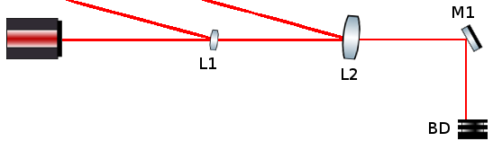
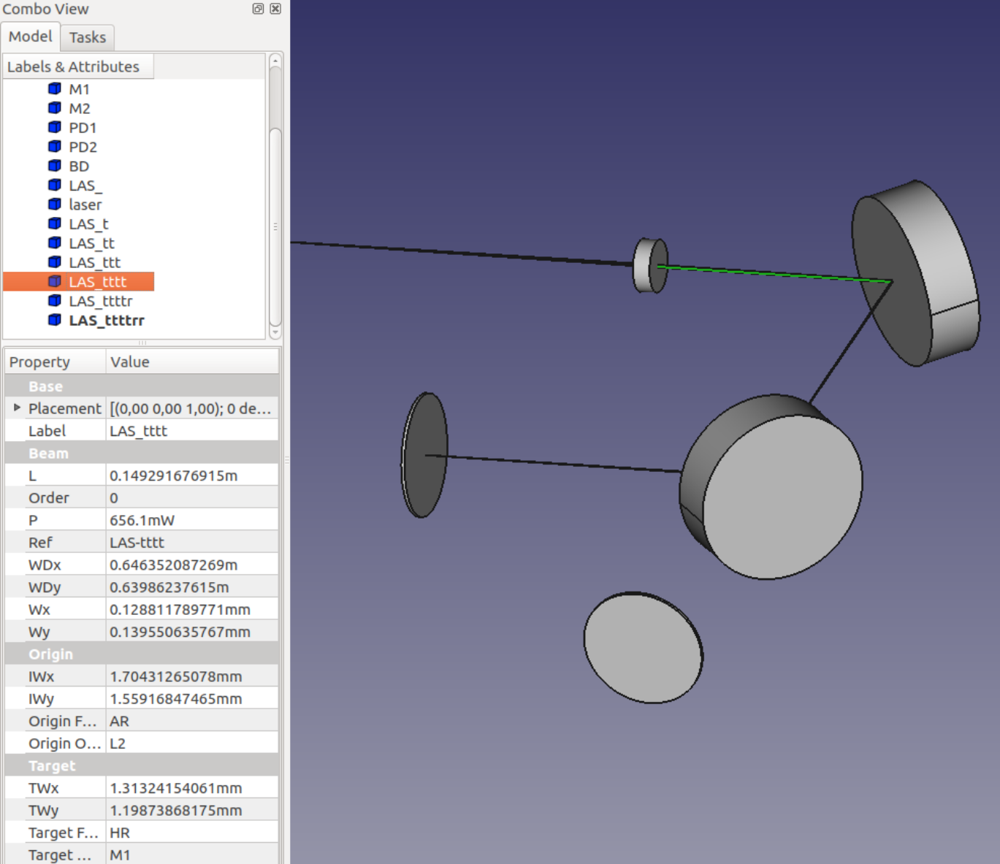

In this tutorial, we will explain the basic CLI usage of `theia` using the example of the `alloptics.tia` file found in the `tutos/` directory of the project repository.

To learn more on the input `.tia` file, please see the Quick Reference found at the [Documentation](../docs/) page.

### Situation

We would like to simulate the setup described in the following figure. This setup will allow us to review all the possible optics available in the `theia` tool.

### The input file syntax

In the input file, each line specifies **one optical component** or **one parameter** for the simulation. You can put in comments with the hash symbol `#`.

* If a line starts with `order = ` or `threshold = `, then what follows is a **Python expression** reducing to an integer or a floating point number to specify the order and threshold of the simulation. Recall that the order of the simulation puts a limit on how *stray* a simulated beam can be: reflecting from a AR surface or transmitting by a HR surface increases the *strayness* order of a beam by 1, and beams are no longer traced if their strayness order is greater than the simulation order. Likewise, beams with powers lower than the simulation threshold are no longer traced.

* If a line starts with `bm`, `bs`, `sp`, `th`, `tk`, `mr`, `bd`, `gh`, then the lines specify respectively a Gaussian input beam, a beam-splitter, a special surface (of which the user specifies the actions of the surfaces on the strayness of beams), a thin lens, a thick lens, a mirror, a beam dump or a ghost surface. After these keywords, the optical parameters follow as a comma-separated list of Python expressions for the constructors. The meaning and order of these parameters are detailed in the Quick Reference document. Note that **all constructors have complete default values**, thus you can specify as much info as you like (from none to all parameters).

* If a line starts with `bo`, then it specifies the **beginning of an optical bench**, and all input until the next `bo` line will be translated in space by the coordinates given by this `bo` entry. This allows to move whole benches around instead of changing the coordinates of each optic individually.

* All other lines are used for the name of the simulation, which appears here and there in the output files.

Some remarks:

* **In the whole input file, you can use the units and functions which are built-in to theia**, these are listed in the Quick Reference document.
* All spaces and tabs are stripped during parsing, so you can throw in as much as you like to format your file.
* Order and threshold lines overwrite each other as the file is parsed, thus only the last ones of the file count for the simulation.
* You can specify the references to each beam or optic with the `Ref = `  entry. This reference will appear in the output file as well as in the 3D rendering later on.
* In the case of beams, the generated beams will be referenced by the reference of their parent beam, plus a `r` or a `t` according to whether they were produced by a reflection or a transmission.

### Getting to know the command

Once you're sure to have understood the `alloptics.tia` configuration file, `cd` to its directory and run the simulation with the `theia` command. For a complete simulation, just run `theia alloptics.tia`.

This will generate two output files:

* The `alloptics.out` text file, which contains the numerical data on the simulated beams,
* The `alloptics.fcstd` CAD file, which contains the 3D viewable of the optical setup, to be read with FreeCAD.

#### The output to the terminal
During the run of the simulation, some output is issued to the terminal to inform or warn you on the simulation. The `theia: Info` lines concern the tracing on the beams. For example:

>theia: Info: Reached beam stop (LASttttr on BD).

signifies that the beam referenced by `LASttttr` (the beam reflected by the beam 4 times transmitted by the original `LAS` beam) has attained the beamdump `BD` and thus finished its journey.

Similarly,

>theia: Info: Reached open beam LASr.

means that the beam reflected by the input beam `LAS` is an open beam and will not interact any more.

Some `theia: Warning` lines may also be issued. They warn the user that some geometrical incoherence (such as self-intersecting components) has been detected, that beam clipping has occurred, or that something went wrong in the simulation.

#### Some command line options

You can change the behavior of the command with some options, you can review them with `theia -h`. The main ones are:

* `-i, --no-info` and `-w, --no-warn`: quiet info or warning output to terminal,
* `-t, --no-text` and `-c, --no-CAD`: do not write the text or the CAD file (use this if you don't have FreeCAD),
* `-l, --FreeCAD-lib`: specifies where the FreeCAD libraries are on your system.

### Troubleshooting

When things go wrong, explicit error messages are issued to the terminal and `theia` exits smoothly.

The most common situations where errors occur are:

* FreeCAD is not installed,
* There is an error in the input file. In this case the error message details where the error occurred.

### Reading the output text file

Open the `alloptics.out` file with your favorite editor.

After some information on the simulation such as the positions of the optics and the order and threshold, you will find the list of simulated beams.

Here is a sample of output:

>       (L1, AR) 0.399005993334m (L2, HR) LAStt {
>               Waist Pos: (0.15859187270392341, 0.15647919582563805)m
>               Waist Size: (0.0474538174182, 0.0515182117911)mm
>               Direction: (90.0, 0.012482604013)deg
>       }

According to this output, the beam `LAStt` (the second transmitted beam of the input `LAS` beam) travels 0.3990... meters between the AR surface of lens L1 to the HR surface of the L2 lens. Its direction in spherical coordinates is (90.0, 0.012...) degrees (see the Quick Reference for the convention we use for spherical coordinates).

Then comes the Gaussian data: you find the pair of waist widths (in X and Y) and the positions of these waists along the beam relatively to the start of the beam (on AR of L1).

### The CAD file

Now, open the `alloptics.fcstd` file with FreeCAD. On the left panel, you will find the **list of all the simulation objects** (beams and optics). Each of these objects contain the relevant optical information as calculated during the simulation.

These objects benefit of all the support provided by the CAD software: they are selectable in the view provider, and can be manipulated at will in terms of position and orientation, etc.

#### 3D navigation

The main interest of the CAD software is to benefit from the **high level 3D navigation capabilities**. The most useful ones are:

* Zooming in and out: with the mouse scroll,
* Translating the view: with the `Ctrl` key and the right mouse button,
* Rotating the view: with the `Ctrl` key kept down and the right-then-left mouse button.

Please see the [FreeCAD documentation](https://www.freecadweb.org/wiki/Download#FreeCAD_documentation) to see all that FreeCAD has to offer in terms of CAD.

#### Reviewing the Gaussian data

By **clicking in the left panel** on a view object, the corresponding object in the 3D view appears in green (and conversely selecting an object in the 3D view highlights the view object in the left panel). Right below the object list, the characteristics of the object appear (curvatures, diameters for mirrors, waists, power for beams, etc.).

This allows for reviewing the Gaussian data of the beams dynamically.

#### Moving the optics around

The objects can be **dynamically moved around** in the 3D view. For example, notice that the beam emerging from M1 and finishing on the beam dump BD arrives at the beam dump exactly in its middle. If we want this beam to arrive at some other point on the beam dump, we may change the coordinates of the beam dump by clicking on it in the 3D view, then changing the`x,y,z` parameters of the `Position` property in the bottom panel (below `Placement`).

Once we have found the correct position on the beam dump, we may write down the new position and keep it for later. We may then update the optics position in the configuration file (and on the bench in the lab).

Note: manipulating the optics in FreeCAD **will not update the Gaussian data of the beams** (no simulation is rerun).

The next figure is a screenshot from a more complex example.

#### Exporting to other formats

FreeCAD also allows to export the CAD information to other CAD formats (`.step`, `.xml`, etc.). To do this, go to `File -> Export...` and choose the file and format.
